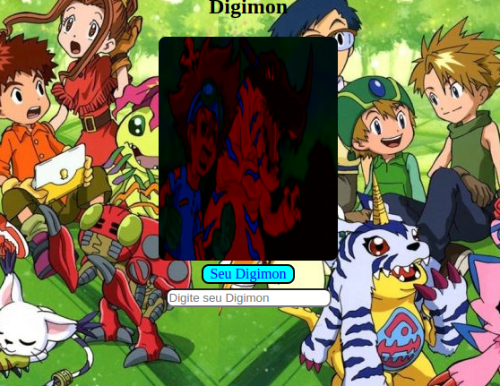

# digimonsApi
Api dos personagens Digimons. Baseado em cards, onde o usuário digita o nome do personagem digimon e aparece a imagem, assim como tbém seu nome.

## Para rodar a aplicação:
## inicialmente um git clone :
git clone git@github.com:reinaldoper/digimonsApi.git
 
Após, um npm install para baixar as dependencias do projeto.
 
Para rodar no terminal, baixar a extensão GO LIVE 
 
#A primeira Tela da aplicação:
 

## API se encontra nesse link:https://digimon-api.vercel.app/api/digimon
